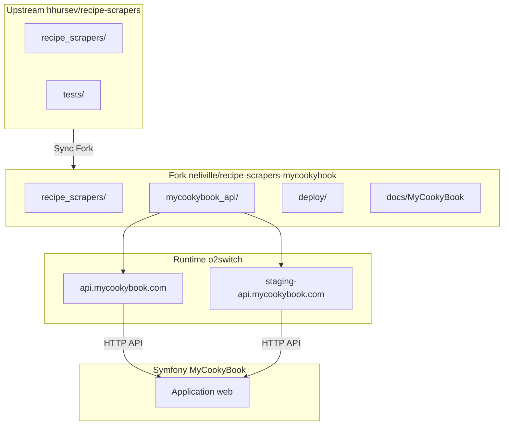

# Roadmap MyCookyBook

> Vision et planification — fork [neliville/recipe-scrapers-mycookybook](https://github.com/neliville/recipe-scrapers-mycookybook)  
> Dernière mise à jour : 20 juin 2026

---

## 1. Vue d'ensemble

MyCookyBook s'appuie sur le fork `recipe-scrapers-mycookybook` pour fournir :

1. Une **API Flask** de scraping et parsing d'ingrédients multilingues.
2. Une **couche métier isolée** (`mycookybook_api/`) sans modifier `recipe_scrapers/`.
3. Un **cycle de vie Git** compatible Sync Fork upstream.
4. Un **déploiement o2switch** staging → production.



---

## 2. État actuel — API Flask

### Architecture

| Composant | État | Détail |
|---|---|---|
| `app.py` | Monolithique (~1346 lignes) | 5 routes JSON, non modifié |
| `passenger_wsgi.py` | Entry WSGI | Import relatif, non modifié |
| `recipe_scrapers` | Upstream | Import via `scrape_html` |
| JSON units | Utilisé | Chargement CWD-relative (fragile) |
| JSON ingredients | Présent, non utilisé | ~9977 entrées, phase 2 |
| Structure modulaire | Squelettes vides | `services/`, `parsers/`, `config/`, `tests/` |

### Endpoints API

| Route | Méthodes | Description |
|---|---|---|
| `/` | GET | Documentation JSON |
| `/scrape` | GET, POST | Scrape recette + parsing ingrédients |
| `/scrape-v2` | GET, POST | Scrape alternatif avec score qualité |
| `/parse-ingredient` | POST | Parse un ingrédient multilingue |
| `/parse-ingredients` | POST | Parse une liste d'ingrédients |

### Dépendances clés

- Flask ≥ 2.0
- recipe-scrapers ≥ 15.0 (depuis le fork local via `pip install -e .`)
- extruct, beautifulsoup4, lxml, requests

---

## 3. Phases de développement

### Phase 0 — Préparation (EN COURS)

| Tâche | Statut |
|---|---|
| Isoler `mycookybook_api/` | Fait |
| Structure modulaire (squelettes) | Fait |
| Documentation déploiement | Fait |
| Correction CRLF | Fait |
| Config Git WSL | Fait |
| Audit structure | Fait |
| Premier commit MyCookyBook | **À faire** |
| Création branche `develop` | **À faire** |
| `.gitattributes` | **À créer manuellement** |

### Phase 1 — Stabilisation API (prochaine)

| Tâche | Priorité |
|---|---|
| Corriger chemin JSON (`Path(__file__)`) | Élevée |
| Ajouter tests API (`mycookybook_api/tests/`) | Élevée |
| Premier déploiement staging o2switch | Élevée |
| Valider les 5 endpoints en conditions réelles | Élevée |
| Retirer `ingredient-parser-nlp` si inutilisé | Faible |

### Phase 2 — Refactor modulaire

| Tâche | Priorité |
|---|---|
| Extraire `MultilingualIngredientParser` → `parsers/` | Moyenne |
| Extraire logique scrape → `services/scraper.py` | Moyenne |
| Extraire logique parse → `services/ingredient.py` | Moyenne |
| Configuration staging/prod → `config/settings.py` | Moyenne |
| Intégrer `ingredients_multilingual_complete.json` | Moyenne |
| Wrapper `passenger_wsgi.py` root (si cPanel l'exige) | Faible |

### Phase 3 — Production et intégration Symfony

| Tâche | Priorité |
|---|---|
| Go-live `api.mycookybook.com` | Élevée |
| Intégration HTTP Symfony → API Flask | Élevée |
| Monitoring et logs centralisés | Moyenne |
| Rate limiting / cache | Faible |
| Décommissionner appels directs si migration complète | Long terme |

---

## 4. Intégration Symfony MyCookyBook

### Modèle d'intégration recommandé

Symfony (application principale MyCookyBook) consomme l'API Flask comme **microservice interne** :

```
Utilisateur → Symfony (mycookybook.com)
                    │
                    │ HTTP interne
                    ▼
              api.mycookybook.com (Flask)
                    │
                    │ scrape_html()
                    ▼
              recipe_scrapers/
```

### Contrat d'API

| Endpoint Symfony | Endpoint Flask | Usage |
|---|---|---|
| Import recette par URL | `POST /scrape` | Scrape + parse ingrédients |
| Parse ingrédient unitaire | `POST /parse-ingredient` | Normalisation multilingue |
| Parse liste ingrédients | `POST /parse-ingredients` | Batch parsing |
| Import recette v2 | `POST /scrape-v2` | Score qualité |

### Configuration Symfony (future)

```yaml
# config/services.yaml (exemple)
parameters:
    recipe_scraper_api_url: '%env(RECIPE_SCRAPER_API_URL)%'
    # staging : https://staging-api.mycookybook.com
    # prod    : https://api.mycookybook.com
```

### Points d'attention

- **Latence** : `/scrape` peut prendre plusieurs secondes (fetch HTTP du site cible).
- **Timeout Symfony** : configurer un timeout HTTP client ≥ 30s pour les appels scrape.
- **Erreurs** : l'API Flask retourne du JSON structuré — mapper vers les exceptions Symfony.
- **Staging** : Symfony dev/staging pointe vers `staging-api.mycookybook.com`.

---

## 5. Stratégie de synchronisation du fork

### Principe

Le fork reste un **superset** de l'upstream :

```
upstream/main  +  commits MyCookyBook  =  origin/main
```

Les dossiers MyCookyBook sont **hors périmètre upstream** — aucun conflit lors du Sync Fork.

| Zone | Sync Fork | Action |
|---|---|---|
| `recipe_scrapers/` | Mis à jour | Accepter upstream |
| `tests/` | Mis à jour | Accepter upstream |
| `mycookybook_api/` | Jamais touché | Conserver tel quel |
| `deploy/` | Jamais touché | Conserver tel quel |
| `docs/MYCOOKYBOOK_*` | Jamais touché | Conserver tel quel |

### Fréquence recommandée

| Environnement | Sync upstream | Déploiement |
|---|---|---|
| Local | Avant chaque sprint | — |
| Staging | Après sync + tests locaux | `git pull origin develop` |
| Production | Après validation staging | `git pull origin main` |

Voir [GIT_WORKFLOW.md](GIT_WORKFLOW.md) pour la procédure détaillée.

---

## 6. Gestion des mises à jour upstream

### Workflow type

1. **Sync Fork** sur GitHub (`upstream/main` → `origin/main`)
2. **Pull local** : `git checkout main && git pull origin main`
3. **Tests locaux** : `pytest tests/` (upstream)
4. **Merge vers develop** : `git checkout develop && git merge main`
5. **Tests API** : futurs tests `mycookybook_api/tests/`
6. **Deploy staging** : `git pull origin develop` sur o2switch staging
7. **Validation** : curl endpoints
8. **Release** : merge `develop` → `main`, tag, deploy production

### Risques upstream

| Risque | Impact | Mitigation |
|---|---|---|
| Breaking change `scrape_html` API | API Flask cassée | Tests avant deploy ; pin version si nécessaire |
| Nouvelle dépendance upstream | Conflit requirements | Réconcilier `pyproject.toml` + `requirements.txt` |
| Suppression scraper utilisé | Scrape échoue pour certains sites | Monitoring + issue upstream |
| CRLF réintroduit | Faux positifs Git | `.gitattributes` + `autocrlf input` |

---

## 7. Déploiement staging

| Paramètre | Valeur |
|---|---|
| Domaine | `staging-api.mycookybook.com` |
| Application root | `/home/iwob6566/public_html/staging-api.mycookybook.com` |
| Startup file | `mycookybook_api/passenger_wsgi.py` |
| Entry point | `application` |
| Branche | `develop` |
| Virtualenv | `~/venv/staging-api` |

**Guide complet** : [deploy/o2switch-staging.md](../deploy/o2switch-staging.md)

### Critères de validation staging

- [ ] 5 endpoints répondent correctement
- [ ] Scrape Marmiton / 750g / BBC Good Food (échantillon)
- [ ] Parse ingrédient FR/EN/ES
- [ ] Logs Passenger sans erreur 24h
- [ ] `pip install -e .` fonctionne après `git pull`

---

## 8. Déploiement production

| Paramètre | Valeur |
|---|---|
| Domaine | `api.mycookybook.com` |
| Application root | `/home/iwob6566/public_html/api.mycookybook.com` |
| Startup file | `mycookybook_api/passenger_wsgi.py` |
| Entry point | `application` |
| Branche | `main` |
| Virtualenv | `~/venv/production-api` |

**Guide complet** : [deploy/o2switch-production.md](../deploy/o2switch-production.md)

### Critères go-live

- [ ] Staging stable ≥ 1 semaine
- [ ] Tag release sur `main`
- [ ] SSL actif
- [ ] Symfony configuré avec `RECIPE_SCRAPER_API_URL=https://api.mycookybook.com`
- [ ] Rollback testé

---

## 9. Risques identifiés

| # | Risque | Sévérité | Phase | Mitigation |
|---|---|---|---|---|
| 1 | Chemin JSON relatif CWD | Élevée | 1 | `Path(__file__).resolve().parent` |
| 2 | Import `recipe_scrapers` sur o2switch | Élevée | 1 | Clone complet + `pip install -e .` |
| 3 | CRLF récidive | Élevée | 0 | `.gitattributes` + config Git (fait) |
| 4 | `passenger_wsgi.py` import relatif | Moyenne | 1–2 | App root = racine clone ; wrapper root si besoin |
| 5 | Monolithe `app.py` difficile à maintenir | Moyenne | 2 | Refactor services/parsers |
| 6 | Pas de tests API | Moyenne | 1 | `mycookybook_api/tests/` |
| 7 | Timeout scrape sur sites lents | Moyenne | 3 | Timeout client Symfony ; logs |
| 8 | Breaking change upstream | Moyenne | Continu | Sync fréquent + tests |
| 9 | `ingredient-parser-nlp` inutilisé | Faible | 2 | Retirer de requirements.txt |
| 10 | Confusion doc deploy legacy vs o2switch | Faible | 0 | Guides `o2switch-*.md` (fait) |

---

## 10. Calendrier indicatif

| Période | Objectif |
|---|---|
| Juin 2026 | Phase 0 — Préparation, premier commit, `.gitattributes` |
| Juillet 2026 | Phase 1 — Stabilisation, deploy staging, tests API |
| Août 2026 | Phase 2 — Refactor modulaire, intégration Symfony dev |
| Septembre 2026 | Phase 3 — Go-live production, monitoring |

> Calendrier indicatif — ajuster selon les priorités métier MyCookyBook.

---

## 11. Documentation associée

| Document | Contenu |
|---|---|
| [MYCOOKYBOOK_MIGRATION_PLAN.md](MYCOOKYBOOK_MIGRATION_PLAN.md) | Analyse initiale, routes, dépendances |
| [PROJECT_STRUCTURE_AUDIT.md](PROJECT_STRUCTURE_AUDIT.md) | Audit structure, incohérences |
| [GIT_WORKFLOW.md](GIT_WORKFLOW.md) | Branches, Sync Fork, staging → prod |
| [GIT_CLEANUP_PLAN.md](GIT_CLEANUP_PLAN.md) | Nettoyage CRLF (exécuté) |
| [GITATTRIBUTES_RECOMMENDED.md](GITATTRIBUTES_RECOMMENDED.md) | Proposition `.gitattributes` |
| [deploy/o2switch-staging.md](../deploy/o2switch-staging.md) | Déploiement staging o2switch |
| [deploy/o2switch-production.md](../deploy/o2switch-production.md) | Déploiement production o2switch |
