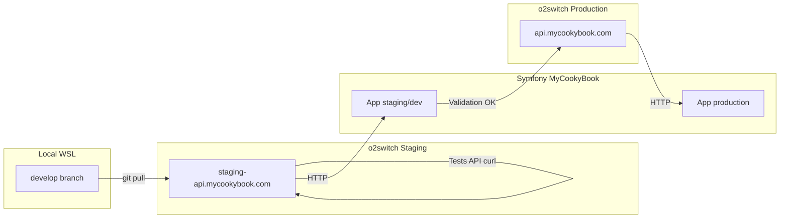

# Plan de déploiement o2switch — MyCookyBook API

> Plan technique — premier déploiement staging → production  
> Basé sur [O2SWITCH_DEPLOYMENT_AUDIT.md](O2SWITCH_DEPLOYMENT_AUDIT.md)  
> Contraintes : pas de modification `recipe_scrapers/`, `app.py`, `passenger_wsgi.py`

---

## Vue d'ensemble



| Étape | Objectif | Environnement |
|---|---|---|
| 1 | Déploiement staging | `staging-api.mycookybook.com` |
| 2 | Tests API | Staging |
| 3 | Validation Symfony | Staging → Symfony staging |
| 4 | Passage production | `api.mycookybook.com` |

**Configuration Passenger retenue (Option A)** :

| Paramètre | Staging | Production |
|---|---|---|
| Application root | `/home/iwob6566/public_html/staging-api.mycookybook.com` | `/home/iwob6566/public_html/api.mycookybook.com` |
| Startup file | `mycookybook_api/passenger_wsgi.py` | idem |
| Entry point | `application` | idem |
| Python | 3.11 | 3.11 |
| Branche Git | `develop` | `main` |

---

## Étape 1 — Déploiement staging

### 1.1 Prérequis

- [ ] DNS Cloudflare `staging-api.mycookybook.com` → IP o2switch (fait)
- [ ] Accès SSH o2switch (`iwob6566`)
- [ ] Accès cPanel → Setup Python App
- [ ] Premier commit MyCookyBook poussé sur GitHub (branche `develop`)
- [ ] Certificat SSL cPanel + Cloudflare mode **Full**

### 1.2 Clone et installation

```bash
ssh iwob6566@<serveur-o2switch>

mkdir -p /home/iwob6566/public_html/staging-api.mycookybook.com
cd /home/iwob6566/public_html/staging-api.mycookybook.com

git clone https://github.com/neliville/recipe-scrapers-mycookybook.git .
git checkout develop
```

### 1.3 Contournement chemin JSON (sans modifier app.py)

```bash
cd /home/iwob6566/public_html/staging-api.mycookybook.com
ln -sf mycookybook_api/units_multilingual_complete.json units_multilingual_complete.json
```

> Voir audit §6 — obligatoire avec Option A tant que `app.py` utilise un chemin CWD-relative.

### 1.4 Environnement Python

```bash
python3.11 -m venv ~/venv/staging-api
source ~/venv/staging-api/bin/activate

pip install --upgrade pip

# OBLIGATOIRE : recipe_scrapers depuis le fork
pip install -e .

# Dépendances API Flask
pip install -r mycookybook_api/requirements.txt
```

**Vérification installation** :

```bash
python -c "from recipe_scrapers import scrape_html; print('OK recipe_scrapers')"
python -c "import flask, extruct, lxml, requests; print('OK deps')"
```

### 1.5 Configuration cPanel o2switch

1. cPanel → **Setup Python App** → **Create Application**
2. Renseigner :

| Champ | Valeur |
|---|---|
| Python version | 3.11 |
| Application root | `/home/iwob6566/public_html/staging-api.mycookybook.com` |
| Application URL | `staging-api.mycookybook.com` |
| Application startup file | `mycookybook_api/passenger_wsgi.py` |
| Application Entry point | `application` |

3. Associer virtualenv `~/venv/staging-api`
4. **Restart** l'application

### 1.6 Vérification démarrage

```bash
# Logs Passenger
tail -f /home/iwob6566/public_html/staging-api.mycookybook.com/logs/passenger.log

# Test rapide
curl -s -o /dev/null -w "%{http_code}" https://staging-api.mycookybook.com/
# Attendu : 200
```

**Critères de succès Étape 1** :

- [ ] HTTP 200 sur `/`
- [ ] Pas d'erreur import dans logs Passenger
- [ ] Symlink JSON en place

---

## Étape 2 — Tests API

### 2.1 Tests smoke (obligatoires)

```bash
BASE=https://staging-api.mycookybook.com

# 1. Documentation API
curl -s "$BASE/" | python3 -m json.tool

# 2. Parse ingrédient FR (valide le chargement JSON units)
curl -s -X POST "$BASE/parse-ingredient" \
  -H "Content-Type: application/json" \
  -d '{"ingredient": "200 g de farine", "language": "fr"}' | python3 -m json.tool

# 3. Parse ingrédient avec unité cuillère (test patterns dynamiques JSON)
curl -s -X POST "$BASE/parse-ingredient" \
  -H "Content-Type: application/json" \
  -d '{"ingredient": "2 cuillères à soupe d huile d olive", "language": "fr"}' | python3 -m json.tool

# 4. Parse batch
curl -s -X POST "$BASE/parse-ingredients" \
  -H "Content-Type: application/json" \
  -d '{"ingredients": ["3 oeufs", "100 ml de lait"], "language": "fr"}' | python3 -m json.tool

# 5. Scrape recette (URL valide — adapter)
curl -s "$BASE/scrape?webUrl=https://www.marmiton.org/recettes/recette_risotto-aux-champignons.php&language=fr" \
  | python3 -m json.tool | head -50

# 6. Scrape v2
curl -s "$BASE/scrape-v2?webUrl=https://www.marmiton.org/recettes/recette_risotto-aux-champignons.php" \
  | python3 -m json.tool | head -30
```

### 2.2 Critères de validation parse-ingredient

Réponse attendue (extrait) :

```json
{
  "success": true,
  "data": {
    "raw": "200 g de farine",
    "ingredient": "farine",
    "quantity": 200.0,
    "unit": "g",
    "detected_language": "fr"
  }
}
```

**Test critique JSON units** : si `"unit": ""` sur « 2 cuillères à soupe », le symlink JSON est absent ou incorrect.

### 2.3 Tests de non-régression

| Test | Commande | Attendu |
|---|---|---|
| Paramètre manquant | `curl -s "$BASE/scrape"` | HTTP 400, `"Missing parameter webUrl"` |
| Ingrédient manquant | `POST /parse-ingredient` body `{}` | HTTP 400 |
| URL invalide scrape | `webUrl=not-a-url` | HTTP 500 ou message erreur JSON |
| Langue EN | `"language": "en"` sur parse | unités EN détectées |

### 2.4 Tests performance

| Endpoint | Seuil acceptable |
|---|---|
| `/parse-ingredient` | < 500 ms |
| `/scrape` | < 25 s (timeout interne 20s + marge) |
| `/` | < 200 ms |

### 2.5 Checklist Étape 2

- [ ] 5 endpoints répondent HTTP 200 (cas nominal)
- [ ] Parse FR avec unités grammes OK
- [ ] Parse FR avec cuillères OK (confirme JSON units chargé)
- [ ] Scrape Marmiton ou site équivalent OK
- [ ] Scrape-v2 retourne `quality_score`
- [ ] Erreurs 400 sur paramètres manquants
- [ ] Logs Passenger sans traceback au démarrage

---

## Étape 3 — Validation Symfony

### 3.1 Configuration Symfony staging

Dans l'application Symfony MyCookyBook (staging/dev), configurer :

```yaml
# .env.local (exemple)
RECIPE_SCRAPER_API_URL=https://staging-api.mycookybook.com
```

Ou paramètre équivalent dans `services.yaml` / client HTTP.

### 3.2 Scénarios de validation Symfony

| # | Scénario | Endpoint Flask | Critère succès |
|---|---|---|---|
| 1 | Import recette par URL | `GET /scrape?webUrl=...` | Symfony reçoit titre + ingrédients parsés |
| 2 | Parse ingrédient unitaire | `POST /parse-ingredient` | Normalisation stockée en base |
| 3 | Parse liste ingrédients | `POST /parse-ingredients` | Batch import OK |
| 4 | Timeout scrape | `/scrape` site lent | Symfony gère timeout ≥ 30s sans crash |
| 5 | Erreur scrape (URL invalide) | `/scrape` | Symfony affiche message utilisateur |

### 3.3 Configuration client HTTP Symfony

| Paramètre | Valeur recommandée |
|---|---|
| Timeout connexion | 10 s |
| Timeout total scrape | **30 s** minimum |
| Retry | 0–1 (scrape non idempotent côté réseau) |
| Headers | `Content-Type: application/json` pour POST |

### 3.4 Tests d'intégration manuels

1. Depuis Symfony staging : importer une recette Marmiton via URL
2. Vérifier en base : titre, ingrédients parsés (quantité, unité, nom)
3. Tester parse ingrédient saisi manuellement en FR
4. Vérifier les logs Symfony — pas de timeout
5. Tester avec Cloudflare actif (DNS production-like)

### 3.5 Checklist Étape 3

- [ ] Variable `RECIPE_SCRAPER_API_URL` pointe vers staging
- [ ] Import recette URL fonctionne end-to-end
- [ ] Ingrédients parsés correctement en base Symfony
- [ ] Gestion erreur API (400/500) côté Symfony
- [ ] Timeout scrape configuré ≥ 30s
- [ ] Validation métier OK par équipe MyCookyBook

**Durée recommandée** : staging stable ≥ **1 semaine** avant production.

---

## Étape 4 — Passage production

### 4.1 Prérequis go-live

- [ ] Étape 2 — tous tests API passent
- [ ] Étape 3 — Symfony staging validé ≥ 1 semaine
- [ ] Merge `develop` → `main` sur GitHub
- [ ] Tag release (`v2.x.x`)
- [ ] DNS Cloudflare `api.mycookybook.com` → o2switch (fait)

### 4.2 Déploiement production

```bash
ssh iwob6566@<serveur-o2switch>

mkdir -p /home/iwob6566/public_html/api.mycookybook.com
cd /home/iwob6566/public_html/api.mycookybook.com

git clone https://github.com/neliville/recipe-scrapers-mycookybook.git .
git checkout main

# Symlink JSON (identique staging)
ln -sf mycookybook_api/units_multilingual_complete.json units_multilingual_complete.json

python3.11 -m venv ~/venv/production-api
source ~/venv/production-api/bin/activate
pip install --upgrade pip
pip install -e .
pip install -r mycookybook_api/requirements.txt
```

### 4.3 Configuration cPanel production

| Champ | Valeur |
|---|---|
| Python version | 3.11 |
| Application root | `/home/iwob6566/public_html/api.mycookybook.com` |
| Application URL | `api.mycookybook.com` |
| Application startup file | `mycookybook_api/passenger_wsgi.py` |
| Application Entry point | `application` |
| Virtualenv | `~/venv/production-api` |

### 4.4 Bascule Symfony production

```yaml
# .env.local production
RECIPE_SCRAPER_API_URL=https://api.mycookybook.com
```

Procédure :

1. Déployer API production (étape 4.2–4.3)
2. Exécuter tests API production (reprise Étape 2 avec `BASE=https://api.mycookybook.com`)
3. Mettre à jour config Symfony production
4. Test import recette production
5. Monitoring logs 24h

### 4.5 Rollback

```bash
cd /home/iwob6566/public_html/api.mycookybook.com
git tag -l 'v*'
git checkout v2.0.0   # tag stable précédent
source ~/venv/production-api/bin/activate
pip install -e .
pip install -r mycookybook_api/requirements.txt
# Restart cPanel Python App
```

### 4.6 Checklist go-live

- [ ] Tests API production identiques staging
- [ ] Symfony production pointe vers `api.mycookybook.com`
- [ ] SSL actif (Cloudflare + cPanel)
- [ ] Logs Passenger production sans erreur
- [ ] Rollback testé
- [ ] Équipe informée

---

## PHASE 4 — Structure future et refactor modulaire

> Proposition architecturale — **aucune modification de code dans cette phase**

### Arborescence cible

```
mycookybook_api/
├── __init__.py
├── app.py                      # routes Flask uniquement (mince)
├── passenger_wsgi.py           # entry WSGI (inchangé ou wrapper)
├── requirements.txt
├── config/
│   ├── __init__.py
│   └── settings.py             # URLs, timeouts, chemins JSON
├── services/
│   ├── __init__.py
│   ├── scraper_service.py      # logique /scrape, /scrape-v2
│   └── ingredient_service.py   # logique /parse-*
├── parsers/
│   ├── __init__.py
│   ├── schema_org.py           # parse_iso_duration, extract_json_ld, etc.
│   ├── extruct_parser.py       # extract_recipe_with_extruct
│   └── ingredient_parser.py    # MultilingualIngredientParser
├── tests/
│   ├── __init__.py
│   ├── conftest.py
│   ├── test_scraper_service.py
│   ├── test_ingredient_parser.py
│   └── test_routes.py
├── templates/.gitkeep
├── static/.gitkeep
├── units_multilingual_complete.json
└── ingredients_multilingual_complete.json
```

### Futurs services proposés

#### `services/scraper_service.py`

| Méthode | Responsabilité | Extrait de app.py |
|---|---|---|
| `scrape_recipe(url, parse_ingredients, language)` | Orchestration `/scrape` | `scrape_with_enhanced_schema`, sérialisation scraper |
| `scrape_recipe_v2(url)` | Orchestration `/scrape-v2` | `extract_recipe_with_extruct`, score qualité |
| `fetch_html(url, timeout=20)` | HTTP GET avec headers | Bloc `requests.get` dupliqué |
| `serialize_scraper(scraper)` | Appels safe_call | Fonctions nested dans routes |

#### `services/ingredient_service.py`

| Méthode | Responsabilité |
|---|---|
| `parse_one(text, language)` | Wrapper `/parse-ingredient` |
| `parse_many(texts, language)` | Wrapper `/parse-ingredients` |
| `parse_scraped_list(ingredients, language)` | Parsing post-scrape |
| `resolve_language(code)` | Conversion `'auto'` → `Language` enum |

### Futurs parsers proposés

#### `parsers/schema_org.py`

| Fonction / classe | Extrait de app.py |
|---|---|
| `parse_iso_duration()` | l.36 |
| `extract_json_ld()` | l.72 |
| `find_recipe_schema()` | l.101 |
| `extract_time_from_schema()` | l.134 |
| `scrape_with_enhanced_schema()` | l.165 |

#### `parsers/extruct_parser.py`

| Fonction | Extrait de app.py |
|---|---|
| `extract_recipe_with_extruct()` | l.971 |

#### `parsers/ingredient_parser.py`

| Classe / enum | Extrait de app.py |
|---|---|
| `Language` | l.298 |
| `ParsedIngredient` | l.307 |
| `MultilingualIngredientParser` | l.316–936 |

**Évolution JSON** : charger `units_multilingual_complete.json` et `ingredients_multilingual_complete.json` via `config/settings.py` avec `Path(__file__)`.

### Tests unitaires nécessaires

#### `tests/test_ingredient_parser.py` (priorité haute)

| Test | Input | Assertion |
|---|---|---|
| `test_parse_fr_grams` | `"200 g de farine"` | quantity=200, unit=`g`, ingredient=`farine` |
| `test_parse_fr_tablespoon` | `"2 cuillères à soupe d huile"` | quantity=2, unit non vide |
| `test_parse_en_cup` | `"1 cup flour"` | quantity=1, unit=`cup` |
| `test_parse_auto_language` | `"3 eggs"` | detected_language=`en` |
| `test_parse_empty` | `""` | ingredient=`""` |
| `test_parse_with_note` | `"2 tomates, bien mûres"` | note non vide |
| `test_units_json_loaded` | — | len(units) > 0 (régression symlink/Path) |

#### `tests/test_scraper_service.py` (priorité moyenne)

| Test | Type | Assertion |
|---|---|---|
| `test_parse_iso_duration_pt1h30m` | unit | retourne 90 |
| `test_parse_iso_duration_invalid` | unit | retourne None |
| `test_find_recipe_schema` | unit | trouve @type Recipe |
| `test_scrape_recipe_mock` | integration (mock requests) | success=True, title présent |

#### `tests/test_routes.py` (priorité haute)

| Test | Route | Assertion |
|---|---|---|
| `test_home` | `GET /` | 200, clé `endpoints` |
| `test_scrape_missing_url` | `GET /scrape` | 400 |
| `test_parse_ingredient_missing` | `POST /parse-ingredient` | 400 |
| `test_parse_ingredient_ok` | `POST /parse-ingredient` | 200, success=True |
| `test_parse_ingredients_not_list` | `POST /parse-ingredients` | 400 |

#### `tests/conftest.py`

```python
# Fixtures proposées (à implémenter en phase 2)
# - app (Flask test client)
# - ingredient_parser (avec units JSON chargé)
# - sample_recipe_url
# - mock_html_marmiton
```

### Ordre de refactor recommandé (phase 2 code)

1. `config/settings.py` — chemins JSON via `Path(__file__)`
2. `parsers/ingredient_parser.py` — extraction + tests
3. `parsers/schema_org.py` — extraction + tests
4. `services/ingredient_service.py` — extraction + tests routes parse
5. `services/scraper_service.py` — extraction + tests
6. `app.py` — réduit aux routes Flask (~100 lignes)
7. Retirer `ingredient-parser-nlp` de `requirements.txt`

---

## Calendrier indicatif

| Semaine | Action |
|---|---|
| S1 | Étape 1 — Deploy staging + symlink JSON |
| S1 | Étape 2 — Tests API curl |
| S2–S3 | Étape 3 — Validation Symfony staging |
| S4 | Étape 4 — Production (si staging stable) |
| S5+ | Refactor modulaire (phase 2 code) |

---

## Références

- [O2SWITCH_DEPLOYMENT_AUDIT.md](O2SWITCH_DEPLOYMENT_AUDIT.md)
- [deploy/o2switch-staging.md](../deploy/o2switch-staging.md)
- [deploy/o2switch-production.md](../deploy/o2switch-production.md)
- [GIT_WORKFLOW.md](GIT_WORKFLOW.md)
- [MYCOOKYBOOK_ROADMAP.md](MYCOOKYBOOK_ROADMAP.md)
